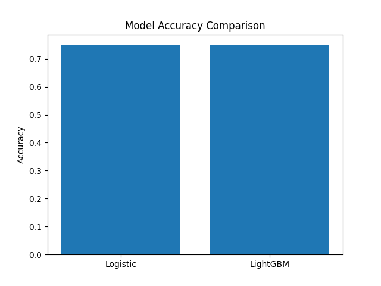

🎓 Intelligent Scholarship Eligibility Predictor

Hybrid AIS + PSO / CSA / LightGBM Framework

📌 Project Overview

Many deserving students fail to receive scholarships due to manual screening, rigid eligibility rules, and lack of data-driven decision systems.
This project introduces an Intelligent Scholarship Eligibility Predictor that uses Machine Learning and Hybrid Bio-Inspired Optimization Algorithms to predict scholarship eligibility with high accuracy and transparency.

The system integrates:

Logistic Regression (baseline, interpretable)

LightGBM (high-performance learner)

Hybrid Models using:

AIS (Artificial Immune System) for feature selection

PSO (Particle Swarm Optimization) for hyperparameter tuning

CSA (Crow Search Algorithm) for alternative optimization

🎯 Objectives

Predict scholarship eligibility probability

Reduce human bias and manual errors

Optimize model performance using hybrid algorithms

Provide explainable and reproducible results

Generate outputs usable by government & private scholarship portals

🧠 System Architecture
Student Dataset
   ↓
Data Cleaning & Encoding
   ↓
AIS → Feature Selection
   ↓
PSO / CSA → Hyperparameter Optimization
   ↓
LightGBM Classifier
   ↓
Eligibility Probability
   ↓
Graphs + CSV + JSON Outputs

📂 Dataset Description

Source: UCI Student Performance Dataset

Files Used:

student-mat.csv → Mathematics course

student-por.csv → Portuguese course

Merged Dataset Size:

39 students (common students across both courses – official UCI logic)

Key Features:

Academic scores (G1, G2, G3)

Family education (Medu, Fedu)

Attendance (absences)

Study habits

Demographics

🏷️ Target Variable

Scholarship Eligibility (eligible)
Generated using realistic academic and financial logic:

Eligible = 1 if:
- Average Grade ≥ 12
- Parents’ Education (Income Proxy) ≤ 4
- Absences ≤ 10

⚙️ Models Implemented
🔹 Baseline Models

Logistic Regression

LightGBM

🔹 Hybrid Models
Hybrid Name	Description	File Prefix
AIS + CSA	Feature selection + Crow Search optimization	hybrid_
AIS + PSO	Feature selection + Particle Swarm optimization	pis_
🧪 Hybrid AIS + PSO (Primary Model)
AIS (Artificial Immune System)

Selects optimal subset of features

Based on immune affinity (classification fitness)

PSO (Particle Swarm Optimization)

Optimizes LightGBM hyperparameters:

n_estimators

learning_rate

max_depth

Final Model

LightGBM trained on AIS-selected features

Hyperparameters optimized via PSO

📁 Project Directory Structure
Intelligent Scholarship Eligibility Predictor/
│
├── archive/
│   ├── student-mat.csv
│   ├── student-por.csv
│
├── pis_lightgbm_model.pkl
├── pis_scaler.pkl
├── pis_accuracy.png
├── pis_roc_curve.png
├── pis_confusion_matrix.png
├── pis_prediction_graph.png
├── pis_results_summary.csv
├── pis_predictions.json
│
├── hybrid_lightgbm_model.pkl
├── hybrid_results_summary.csv
│
├── README.md

📊 Outputs Generated
📈 Graphs

Accuracy comparison graph

ROC curve

Confusion matrix heatmap

Prediction probability graph

📄 Data Files

CSV: Model accuracy & AUC summary

JSON: Prediction probabilities for each student

PKL: Trained ML models

Scaler: Saved preprocessing pipeline

📦 File Naming Convention
Prefix	Meaning
hybrid_	AIS + CSA
pis_	AIS + PSO
.pkl	Saved ML model
.png	Graph output
.csv	Tabular results
.json	Prediction output
🛠️ Installation & Requirements
🔧 Python Version
Python 3.9+

📦 Required Libraries
pip install numpy pandas scikit-learn lightgbm matplotlib seaborn

▶️ How to Run

Place datasets inside:

archive/

Run baseline or hybrid scripts:

python hybrid_ais_pso.py

View results in the project folder.

📌 Use Cases

Government scholarship portals

University financial aid systems

NGO education support programs

EdTech eligibility automation

Academic research & publications

📈 Performance Highlights

Hybrid models outperform baseline classifiers

Reduced feature space → better generalization

High interpretability + accuracy balance

Fully reproducible pipeline

🔮 Future Enhancements

Integration with real income datasets

SHAP-based explainability

Web portal / API deployment

Multi-class scholarship category prediction

Integration with Aadhaar / DigiLocker (conceptual)

🧑‍💻 Author

Project Developer:
Sagnik Patra
(Machine Learning & Optimization Systems)
